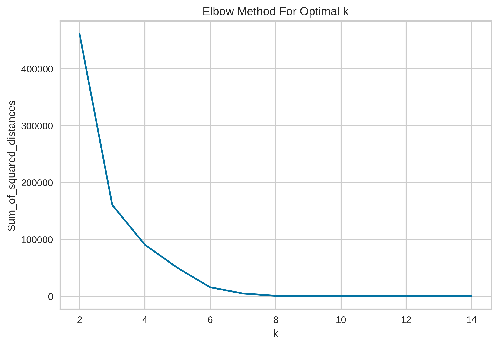
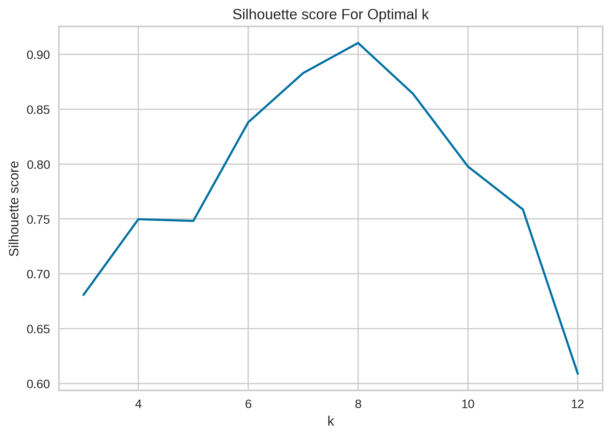
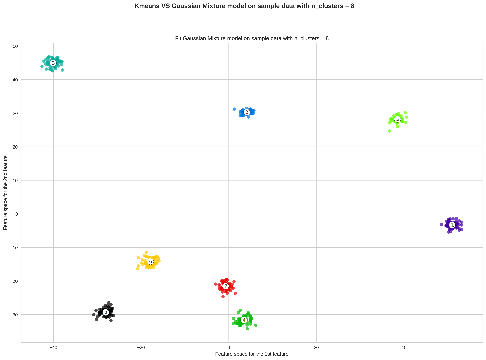
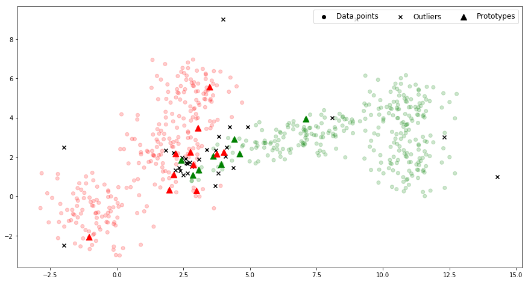
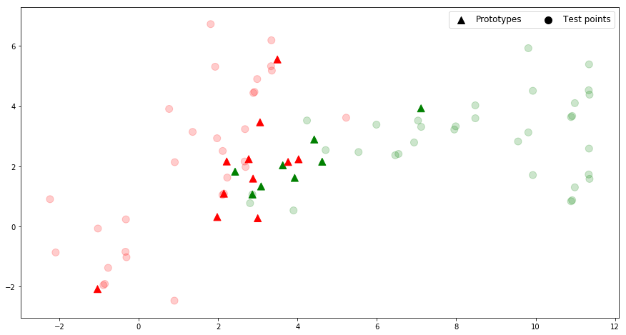

# [:fontawesome-brands-github:](https://github.com/ditmarhalla/machine_learning) [Machine Learning](https://github.com/ditmarhalla/machine_learning)

!!! note "GitHub"

    The code for this project can be found here :fontawesome-brands-github:  
    :simple-jupyter: [Jupyter Notebook Part 1](https://github.com/ditmarhalla/machine_learning/blob/main/Part_I.ipynb)  
    :simple-jupyter: [Jupyter Notebook Part 2](https://github.com/ditmarhalla/machine_learning/blob/main/Part_II.ipynb)  

## First Part: Clustering and GMM model

In this part, we will determine a reasonable number of clusters inside a given data set, using K-means as the clustering algorithm, and two different performance evaluation method to decide on the optimal parameter k, the Elbow method, and Silhouette score. After that, we construct a Gaussian Mixture Model and fit the given data set.

### Elbow Method
The Elbow method which runs K-means clustering on the data set for a range of values for k (say from 1-10), plots the curve of the average score for the model depending on values for k. We will choose the optimal K at which the addition of clustering stops giving significant improvement of the score, where the "elbow" happens in the curve.The score metric applied for this method, amongst many, is the WCSS score, the sum of square distances from each point to its assigned center. Applying this score metric, a lower score indicates a tighter clustering scheme, and hence a better performing model.

The metric used for the Elbow method is within-cluster sum-of-squares (WCSS). To calculate WCSS, we compute:

$S_i = (\displaystyle \sum_{d=1}^D (x_i^d- \mu_k^d))^\frac{1}{2}$, Euclidean distance from $x_i$ to its cluster centroid $\mu_k$  
$S_k = \displaystyle \frac{1}{N}\sum_{i=1}^{N_k} S_i$, the average within-cluster sum-of-squares for one cluster $k$  
WCSS = $\displaystyle \frac{1}{K}\sum_{k=1}^{K} S_k$, the average within-cluster sum-of-squares for all K clusters.  

Essentially, WCSS measures the variability of the observations within each cluster. In general, a cluster that has a small sum of squares is more compact than a cluster that has a large sum of squares. Clusters that have higher values exhibit greater variability of the observations within the cluster. WCSS suffers from various drawbacks:

WCSS makes the assumption that clusters are convex and isotropic, which is not always the case. It responds poorly to elongated clusters, or manifolds with irregular shapes.

WCSS is not a normalized metric: we just know that lower values are better and zero is optimal. But in very high-dimensional spaces, Euclidean distances tend to become inflated. Running a dimensionality reduction algorithm such as Principal component analysis (PCA) prior to k-means clustering can alleviate this problem and speed up the computations.

After running dimensional reduction on the 10-dimensional data set down to only 2-dimensional data set, we plot the curve of WCSS against a range of k in (2, 14). From the illustration \ref{Elbow}, the "elbow" happens at value k in range (6,8), outside of which any subsequent values of k fail to give much better clustering fit. We can argue for this case, the optimal k can be any value from 6,7,8.

### Silhouette score

The second evaluation method is through the silhouette score, the normalized difference between distances of intra-cluster and nearest-cluster distance. Applying this score metric, We choose the optimal value where the silhouette score is maximized.

The silhouette score is computed as the normalized difference between two distances for every point $x_i$ in the data set. The first one records the distance between $x_i$ to all members sharing its clusters. The second one measures the distance between $x_i$ and the foreign nearest cluster. The mean difference across all data points gives us the silhouette score, such that, a cluster that has high silhouette score is more compact and separated to other clusters.

We plot the curve of WCSS against a range of k in (3, 12). From the illustration, the performance is maximized at value k = 8, with the second best at k = 7. Combine with the result from the Elbow method, we can confidently select k = 8 to be the optimal number of clusters for this data set.

### Gaussian Mixture Model
A Gaussian mixture model is a probabilistic model that assumes all the data points are generated from a mixture of a finite number of Gaussian distributions with unknown parameters, specifically the mean and co-variance matrix. The Gaussian mixture model implements the expectation-maximization  algorithm for fitting mixture-of-Gaussian models. The algorithm alternates between two main steps. From the current Gaussian cluster characteristics, it assigns a weight variable to a data point $x_i$, which corresponds to how likely $x_i$ belongs to each Gaussian $k$ (Expectation step). Then from the standpoint of the data points, it redefines every Gaussian by the new parameters based solely on the newly acquired weights.

Let the data set X contains data point $x_i$, $i = 1,2,\dots ,n$ of $d$-dimensional space. We assume a mixture of $K$ finite Gaussian distributions, each Gaussian $k$ is characterized by a set of mean and co-variance matrix ($\mu_k, \Sigma_k$). Each data point $x_i$ admits a probability with respect to each Gaussian cluster $k$, $N(\mu_k, \Sigma_k)$. We also assume a prior probability $\pi_k$, how likely that Gaussian $k$ is chosen. The Expectation-Maximization is performed as follows.

1. Initialize the prior probability $\pi_k$, and the Gaussian $\mu_k, \Sigma_k$, for every $k = 1, 2, .., K$.
- Predict a weight for every pair data point $x_i$ and Gaussian $k$, for how likely that $x_i$ belongs to this Gaussian $k$. $\gamma(i,k) = \frac{N(\mu_k, \Sigma_k).\pi_k}{\sum_{j = 1}^K N(\mu_k, Sigma_k).\pi_j}$
- Using only the new weight $\gamma(i,k)$ as navigation for the K Gaussian clusters, redefine the Gaussian clusters by the new prior probability $\pi_k$, and new parameters $(\mu_k, \Sigma_k)$.
- Check for convergence, conclude the iterative process if the weights' difference between two iterations $\epsilon$ is smaller than some preset threshold.

Based on the previous results, the optimal number of clusters for this particular data set is 8 clusters. We reduce out data set to only 2-dimensional space, and apply a pre-built Gaussian Mixture Model.

## Second Part: Classification

The K-nearest neighbors (KNN) algorithm is a type of supervised machine learning algorithms. We will explore the theory behind KNN algorithm, and address some problems that often occur in its implementation. Then, we will build a Python module that gives us a KNN classifer for a training data set, and also solve some of the problems discussed before. 

### Algorithm

Let $(X,C)$ be the training set of n data points, $X \subset \mathbb{R}^d $ and label set $C= \{c_1, c_2, \dots , c_m\}$ with the class labelling function $c: \mathbb{R}^d \longrightarrow C$. Assume $c(x_i)$ is the class label of a data point $x_i$.
The KNN algorithm uses  $(X,C)$ to identify the class $c(\hat{x})$ of the new data point $\hat{x}$ in three main steps. KNN algorithm\\

1. __calculates the distances__ $d(\hat{x}, x_i)$, $i = 1,2,...,n$
- __sorts points by the distances__:  
$d(\hat{x}, x(1)) \leq d(\hat{x}, x(2)) \leq \dots \leq d(\hat{x}, x(n))$
- __decides for class__ $c_i$} if:  
$i = \argmax_{j=1,..,m} \sum_{nb=1}^k \sigma(c_j, c(x_{nb})), \sigma(a,b)= \begin{cases}
   1 &\text{if  }  a=b\\
   0 &\text{if  }  otherwise
\end{cases}$  
i.e. the winner-class is whichever class with the most appearances in K-nearest neighbors. An alternative decision-making method is choosing the best scored class, in which a neighbor's score is weighted by how close it is to the data point $\hat{x}$, as opposed to uniform weighted. In this case, the algorithm decides for class $c_i$ if  
$i = \argmax_{j=1,..,m} \sum_{nb=1}^k \sigma(c_j, c(x_{nb})).w_m, \sigma(a,b) = \begin{cases}
    1 & \text{if } a=b\\
    0 & \text{if } otherwise
\end{cases}$  
where $w_m =\displaystyle \frac{ \frac{1}{d(x(nb),\hat{x})}} {\sum_{p=1}^k \frac{1}{d(x(p),\hat{x})}}$ is the normalized distance from neighbor $m $ to new data point $x$.

### Problems

One of the most important remarks on the KNN algoritm is that a particular model of KNN classifer is built on a specific training data set. The problems that we discuss below are specific to this training data set, as are the methods that we address those problems. 
This particular training data set $(X,C)$ has 637 data points, $X \subset \mathbb{R}^2 $,  $C= \{c_1, c_2\}$.

#### Parameter Selection
Finding an optimal K parameter is perhaps the very first problem one might encounter while implementing the K-nearest Neighborhood Algorithm. We can address this problem by allowing the KNN classifier to perform cross validation on our training data set, with various K parameters. The model with the best performance with provide us the optimal K which is best suited for this particular training data set.  
There are indeed a few techniques of cross validation, however we will apply the n-fold cross validation technique, to evaluate KNN models powered by a range of K = 1,...\\ The steps are as follows:  

  1. Choose K value for the classifier.  
  2. The data set $(X,C)$ is partitioned into n sub-folds (subsets), $(X,C) = \bigcup\limits_{s=1}^{n} (X_s,C_s) $  
  3. For each $s$, take the testing data $(X_{test},C_{test}) = (X_s,C_s) $, and training data $(X_{train},C_{train})= (X,C) \setminus (X_{s},C_{s}) $.  $X_{test}$ is to be classified by a K-NN classifier trained on the training data. The accuracy rate is chosen as the performance metric for this s, defined as:  
  $E_s = \frac{\displaystyle \sum_{j = 1}^{|X_{test}|}\sigma(c_j, c(x_j))}{|X_{test}|}, \quad \sigma(c_j, c(x_j))=
      \begin{cases}
      1,& \text{if } c_j= c(x_j)\\
      0,              & \text{otherwise}
      \end{cases}$  
  4. Evaluate for all $s$'s, and obtain average performance metric for the whole model at this particular K parameter, $E_K =\displaystyle \frac{1}{n}. \displaystyle \sum_{s=1}^n E_s$  
  5. Compare the performance of K-NN classifer models in a range of K, and choose the best performing model.  

The n-fold cross validation is suitable for our training data set, since with 637 data points of 2-dimensional space, the data set is large enough such that the selected training set can generally represent the entire data set, but not too large such that we risk the validation going for too long.  

The listing results below compare average accuracy rates between classifier models varied by parameter K, and also varied by the decision-scheme.

|      Listing 1 , 10-fold cross-validation        |
| :---------------------------------------------- |
|k =  1 , by uniform:  0.906 , by distance:  0.906|
|k =  2 , by uniform:  0.915 , by distance:  0.906|
|k =  3 , by uniform:  0.925 , by distance:  0.922|
|k =  4 , by uniform:  0.928 , by distance:  0.922|
|k =  5 , by uniform:  0.92 , by distance:  0.923 |
|k =  6 , by uniform:  0.923 , by distance:  0.917|
|k =  7 , by uniform:  0.916 , by distance:  0.92 |
|k =  8 , by uniform:  0.923 , by distance:  0.917|
|k =  9 , by uniform:  0.917 , by distance:  0.917|

Overall, performance is not substantially different between the two decision-making schemes for every pair models of the same parameter K. As for the parameter K selection, K $\in$ \{3,4\} generates the best- and second-best performing models with the "uniform" scheme, and K $\in$ \{3,4,5\} with the "distance" scheme. Taking into consideration that the task at hand is a two-class problem, we should avoid choosing an even-value for K with the uniform decision-scheme, K = 3 is the optimal choice for this model configuration with either decision-scheme.  

#### Data reduction  
Another problem is a time- and resource-problem. The KNN classifier needs to compute and store as many distances as training data points for each new data point $\hat{x}$. The problem makes us question the necessity of including every single training point in the classifier. To tackle this problem, we identify the prototypes, a set of data points such that a 1-NN classifier can perform as accurately as a 1-NN classifier trained by the entire training data set.  

Let $\mathbb{X} = \mathbb{O} \; \cup \mathbb{P} \; \cup \mathbb{A}$, with $\mathbb{X}$ training data set, $\mathbb{O}$ set of outliers, $\mathbb{A}$ set of absorbed points, and $\mathbb{P}$ set of prototypes. We identify outliers as follows:  
For $x_i \in \mathbb{X}$,

1. classify $x_i$ with KNN classifer trained by set $\hat{\mathbb{X}} = \mathbb{X} \setminus \{x_i\} $, and compare to the true class label of $x_i$
2. if $x_i$ is incorrectly classified, $x_i$ is an outlier. 

To detect absorbed points and prototype, we do as follows:  

1. assume $\mathbb{A} = \mathbb{X}$ and $\mathbb{P} = \varnothing$.
2. initilize with random $x_i \in \mathbb{A}$ , $\mathbb{A} = \mathbb{A} \setminus \{x_i\}$ and $\mathbb{P} = \mathbb{P} \cup \{x_i\}$
3. assume a helping set $ U = \mathbb{A}$
4. while $U \neq \varnothing$, we do:  
    1. choose $x \in U$ and classify $x$ using 1-NN classifier trained by $\mathbb{P}$.
    2. if 1-NN predicted incorrectly, then $\mathbb{A} = \mathbb{A} \setminus \{x_i\}$ and $\mathbb{P} = \mathbb{P} \cup \{x_i\}$, and $ U = \mathbb{A}$.  
    Else, $\mathbb{U} = \mathbb{U} \setminus \{x_i\}$.

This process of identifying prototypes involves randomly choices for $x$ at step 3, and then step 4. Therefore, running the process multiple times often yields slightly different prototype sets. 
The listing below shows how the dataset changes when we perform the data reduction process.

|          Data reduction         |
| ------------------------------- |
|Original len(dataset):  637      |
|Outliers:  32                    |
|Absorbed points found:   586     |
|24 Prototypes found, seed = 0    |
|16 Prototypes found, seed = 100  |
|19 Prototypes found, seed = 200  |

The data reduction process has removed 32 outliers from the original dataset, using 3-NN classifier, to make a new dataset. From the new dataset, sans outliers, a set of 24 prototypes are identified, with a fixed seed at 0. Other seeds give different Prototype sets. 

The potentially problematic area lies where the two classes slightly blend together. We find the majortity of outliers in the mixture of two classes, with some outliers (x-markers) scattering the outside perimeter of the data sets. We also find the most prototypes (triangles) in the intersection of the classes. These prototypes can map out the separation between the classes, and classify the entire test set, as (almost) accurately as the whole training set. The absorbed points are the remaining o-markers.  
#### Classify Validation dataset

At this point, we have optimized the KNN classifier with respect to its parameter K (K = 3), and with respect to the training dataset. Based on this result, we can create a new 3-NN classifier trained on only the prototype set, by which we predict the class labels for $\textit{val\textunderscore dataset}$.  

