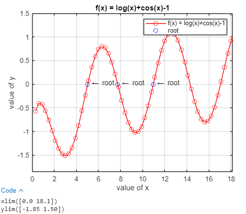
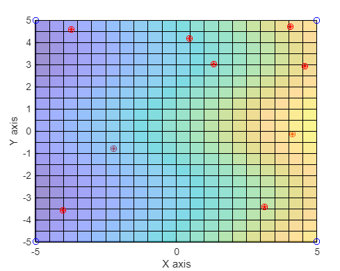
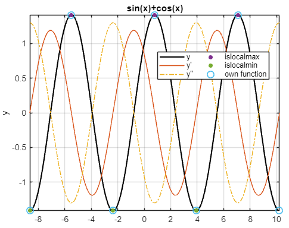

# [:fontawesome-brands-github:](https://github.com/ditmarhalla/numerical_mathematics) [Numerical Mathematics](https://github.com/ditmarhalla/numerical_mathematics)

!!! note "GitHub"

    The code for this project can be found here [:fontawesome-brands-github:](https://github.com/ditmarhalla/numerical_mathematics)  

    :material-file-code: [Report 1: Finding the root](https://github.com/ditmarhalla/numerical_mathematics/blob/main/Report_1/Report_1_Main.m)  

    :material-file-code: Report 2: Interpolation and decomposition  

    - :material-file-code: [Part 1: Interpolation](https://github.com/ditmarhalla/numerical_mathematics/blob/main/Report_1/Report_2_Main.m)  
    - :material-file-code: [Part 2: Decomposition](https://github.com/ditmarhalla/numerical_mathematics/blob/main/Report_2/Report_2_Task_2.m)

    :material-file-code: Report 3: Length along the curve and maxima/minima

    - :material-file-code: [Part 1: Length along the curve](https://github.com/ditmarhalla/numerical_mathematics/blob/main/Report_3/Report_3_Task_1.m)  
    - :material-file-code: [Part 2: Finding minima and maxima](https://github.com/ditmarhalla/numerical_mathematics/blob/main/Report_3/Report_3_Task_2.m)

    :material-file-code: Report 4: ODE and PDE

    - :material-file-code: [Part 1: Predator-prey ODE system](https://github.com/ditmarhalla/numerical_mathematics/blob/main/Report_4/Report_4_Task_1.m)  
    - :material-file-code: [Part 2: Wave equation](https://github.com/ditmarhalla/numerical_mathematics/blob/main/Report_4/Report_4_Task_2.m)


## Report 1: Finding the root

1. Visualize the function with Matlab

```matlab
x = 0:0.3:20;
y = log10(x)+cos(x)-1;
plot(x,y,'r-o')
title('f(x) = log(x)+cos(x)-1'),
xlabel('value of x')
ylabel('value of y')
grid on

```

2. Calculate the root using the integrated "fzero" function
```matlab
r1_fzero = fzero(f,6);
r2_fzero = fzero(f,8);
r3_fzero = fzero(f,10);

```

3. Calculate the root using the "Bisection" method
```matlab
x1_bisection = 1;
x2_bisection = 6;
epsilon = 1e-7;

minTime = Inf;
if f(x1_bisection)*f(x2_bisection)>0
    disp('This is not possible')
else
    r_bisection = 1;
    err = 1;
    i_bisection = 0;
    while err > epsilon
        t_bisection = tic;
        i_bisection = i_bisection+1;
   if f(x1_bisection)*f(r_bisection)<0
       x2_bisection = r_bisection;
   else
       x1_bisection = r_bisection;
   end
    r_bisection = (x1_bisection + x2_bisection)/2;
   err = abs(f(r_bisection));
    end
end
t_bisection_end = toc(t_bisection);
```

4. Calculate the root using the "False Position" method
```matlab
x1_false = 1;
x2_false = 6;

if f(x1_false)*f(x2_false)>0
    disp('This is not possible')
else
    r_false = 1;
    error = abs(f(r_false));
    i_false = 0;
while error > epsilon
        t_false = tic;
        i_false = i_false + 1;
        if f(x1_false)*f(r_false)<0
            x2_false = r_false;
        else
            x1_false = r_false;
        end
        r_false = x1_false-((x2_false - x1_false)*f(x1_false))/(f(x2_false)-f(x1_false));
   error = abs(f(r_false));
end
end
t_false_end = toc(t_false);

```

5. Calculate the root using the "Secant" method
```matlab
x0_secant = 2;
x1_secant = 6;
x2_secant = 1;
r_secant = 1;

i_secant = 0;
while r_secant > epsilon
    t_secant = tic;
    i_secant = i_secant +1;
    x2_secant=x1_secant-f(x1_secant).*((x1_secant-x0_secant)/(f(x1_secant)-f(x0_secant)));
    x0_secant = x1_secant;
    x1_secant = x2_secant;
    r_secant = abs(f(x2_secant));
    s_secant = x2_secant;
end
t_secant_end = toc(t_secant);
```

6. Calculate the root using the "Newton-Raphson" method
```
df =@(x) 1/(x*log(10)) - sin(x);
x_newton = 6;
%dif =@(x_newton) diff(f2);
r_newton = 1;

i_newton = 0;
while r_newton > epsilon
    t_newton = tic;
    i_newton = i_newton + 1;
    x1_newton=x_newton-f(x_newton)/df(x_newton);
    x_newton = x1_newton;
    r_newton = abs(f(x1_newton));
    s_newton = x1_newton;
end
t_newton_end = toc(t_newton);
```

7. Compare the root finding methods
```
Number of iterations with "Bisection method" is:  25
Number of iterations with "False Position method" is:   6
Number of iterations with "Secant method" is:   6
Number of iterations with "Newton-Raphson" is:   5
```

8. Compare the root finding methods to the integrated __fzero__ function
```
The diference with "fzero" and  "Bisection method" is:  0.0000000264
The diference with "fzero" and "False Position method" is:  0.0000000008
The diference with "fzero" and "Secant method" is:  0.00000000000418
The diference with "fzero" and "Newton-Raphson method" is:  0.0000000013
```

9. Visualize using a table to compare the results  

|     Row       |   Root | Iterations | Diference  |   Time     |
|---------------|--------|------------|------------|------------|
|Bisection      | 5.0166 |    25      | 2.6443e-08 | 8.6000e-04 |
|False Position | 5.0166 |      6     | 8.0643e-10 | 8.1200e-04 | 
|Secant         | 5.0166 |      6     | 4.1771e-12 | 8.1700e-04 | 
|Newton-Raphson | 5.0166 |      5     | 1.2582e-09 | 0.0018     | 

---

## Report 2: Interpolation and decomposition  


1.  Bilinear interpolation  
    1.  We using the ’bilinear interpolation method’ to interpolate points in the domain $[−5, 5]×[−5, 5]$ using the function $f(x, y) = x + cos(y) − 1$ respectively: $f(−5, −5), f(5, −5), f(5, 5) and f(−5, 5)$.  
    ```matlab
    function P = bilinear(x,y)
        x1 = -5;  x2 = 5;
        y1 = -5;  y2 = 5;

        f =@(x,y) x+cos(y)-1;

        Q11 = f(x1,y1);  Q12 = f(x1,y2);
        Q21 = f(x2,y1);  Q22 = f(x2,y2);

        R1 = ((x2 - x)/(x2 - x1))*Q11 + ((x - x1)/(x2 - x1))*Q21;
        R2 = ((x2 - x)/(x2 - x1))*Q12 + ((x - x1)/(x2 - x1))*Q22;

        P = ((y2 - y)/(y2 - y1))*R1 + ((y - y1)/(y2 - y1))*R2;
    end
    ```
    For the 1 point:  __x1: 3.15    x2: -3.42    y: 2.43__  
    For the 2 point:  __x1: 4.06    x2: 4.71    y: 3.34__  
    For the 3 point:  __x1: -3.73    x2: 4.57    y: -4.45__  
    For the 4 point:  __x1: 4.13    x2: -0.15    y: 3.42__  
    For the 5 point:  __x1: 1.32    x2: 3.00    y: 0.61__  
    For the 6 point:  __x1: -4.02    x2: -3.58    y: -4.74__  
    For the 7 point:  __x1: -2.22    x2: -0.78    y: -2.93__  
    For the 8 point:  __x1: 0.47    x2: 4.16    y: -0.25__  
    For the 9 point:  __x1: 4.58    x2: 2.92    y: 3.86__  

    2. Interpolate
    ```matlab
    x1 = -5;  x2 = 5;
    y1 = -5;  y2 = 5;
    f=@(x,y) x+cos(y)-1;
    Q11 = f(x1,y1);  Q12 = f(x1,y2);
    Q21 = f(x2,y1);  Q22 = f(x2,y2);

    a = -5; b = 5;
    rr = (b-a).*rand(10,2) + a;
    r = [(rr(:,1)),(rr(:,2))];
    for i = 1:9
        P = bilinear(r(i,1),r(i,2));
        plot3(r(i,1),r(i,2),P,'or') %Plot the interpolated points
    end
    ```
    3. Compare the interpolated values with the exact values given by $f(x, y) = x + cos(y) − 1$ and summarize the results.  
    ```matlab
    for i = 1:9
        fy = f((r(i,1)),(r(i,2)));
        P = bilinear(r(i,1),r(i,2));
        result = fy - P;
        result = abs(result);
    end
    ```
    For the $1^{st}$ point: __1.24__  
    For the $2^{nd}$ point: __0.29__  
    For the $3^{rd}$ point: __0.42__  
    For the $4^{th}$ point: __0.71__  
    For the $5^{th}$ point: __1.27__  
    For the $6^{th}$ point: __1.19__  
    For the $7^{th}$ point: __0.43__  
    For the $8^{th}$ point: __0.81__  
    For the $9^{th}$ point: __1.26__  

    4. Visualizeing the function and the interpolated values.  
      

2. QR decomposition  
    1. Write a Matlab code to calculate the QR decomposition of a real 5x5 matrix using the Gram–Schmidt process.  
    ```matlab
    function [Q,R] =gschmidt(V)
        [m,n]=size(V);
        R=zeros(n);
        R(1,1)=norm(V(:,1));
        Q(:,1)=V(:,1)/R(1,1);
        for k =2:n
            R(1:k-1,k)=Q(:,1:k-1)'*V(:,k);
            Q(:,k)=V(:,k)-Q(:,1:k-1)*R(1:k-1,k);
            R(k,k)=norm(Q(:,k))
            Q(:,k)=Q(:,k)/R(k,k)
        end
    end
    ```
    2. Define an orthogonal matrix Q and an upper triangular matrix $R$ with $A = Q · R$ to test your program.
    ```matlab
    A = rand(5);
    [W,U] = qr(A);
    B_nomral = W*U
    [Q,R] = gschmidt(A);
    B_qr = Q*R
    ```
    3. Extend the code to solve the system $A· x = b$, where b needs to be set accordingly, and compare the result with the built in Matlab function A \ b.
    ```matlab
    x = rand(5,1);

    b=A\x;
    inv(A)\b;

## Report 3: Differentiation and integration

1.  The length along a curve $y = y(x)$ from $x = a$ to $x = b$ is given by the expression  
  $$
  S = \int_{x=a}^{b} \sqrt{1 +  (\dfrac{dx}{dy})^{2} dx.}
  $$
  In most cases this expression cannot be determined analytically. Calculating the given expression numerically for an arbitrary smooth function in the interval $[a, b]$.  
  Differentiate the function using the forward difference scheme  
  ```matlab
  dFun = @(x) Fun(x+h)-Fun(x-h)/2*h;
  ```
  Define the way to calculate the length along the curve  
  ```matlab
  S =@(x) sqrt(1 + dFun(x).^2);
  ```
  Use the function Gauss_quad to integrate numerically  
  ```matlab
  GQ = Gauss_quad(S,1,2);
  ```
  Define the derivative of the function
  ```matlab
  dFun2 = @(x) x.^2/2 - 1./(2*x.^2);
  ```
  Calculate the length of te curve with the derivative  
  ```matlab
  S2 =@(x) sqrt(1 + dFun2(x).^2);

  ```
  Integrated function
  ```matlab
  inte = integral(S2,1,2);
  ```
  Now we calculate the difference between our function and the integrated one  
  ```matlab
  difference = GQ - inte;
  ```
  __The difference between the integrated function and our iteration is: 3.339997e-02 or 97.70 percent__

2.  Finding the local extreme values of a function  
The extreme values of a function $y = y(x)$ are given by $y_0(x) = 0$. However, it has to be checked through the second derivative, if an extreme value is a minima or a maxima.
Differentiate the function using the forward difference scheme
```matlab
dy_hd = @(x) y(x+h)-2*y(x)+y(x-h)./h^2;
```
Then we check if we have a minima or maxima:
```matlab
minima = [];
maxima = [];
for i = 1:length(variable)

    if dy_hd(variable(i))>0
        sol = variable(i);
        minima =[minima,sol];
    end
    if dy_hd(variable(i))<0
        sol1 = variable(i);
        maxima = [maxima,sol1];
    end
end
```


